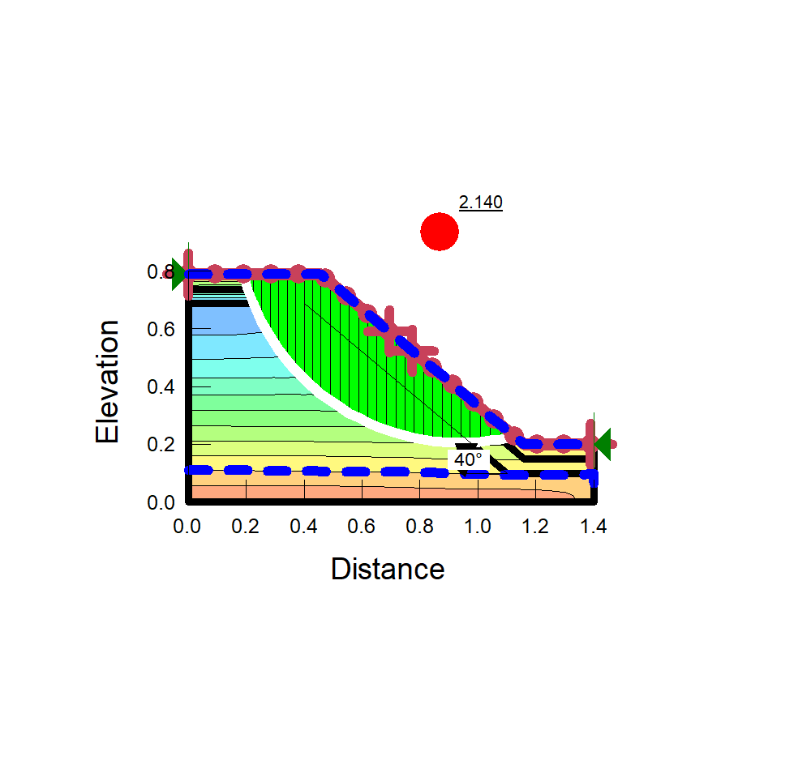

# Slope Stability Analysis of an Earth Embankment
**Software:** GeoStudio 2021 (SLOPE/W, SEEP/W)  
**Analysis Method:** Morgenstern-Price (Limit Equilibrium Method), Steady State method

## 📌 Project Overview
This project involves a geotechnical stability assessment of a soil slope. The goal was to determine the **Factor of Safety (FoS)** against rotational failure under specified surcharge and geometry conditions. Using SLOPE/W, I modeled the soil strata and analyzed the critical slip surface to ensure structural integrity. The slope had FOS < 1.5 under 80mm/hr rainfall so we added CBS as a protective cover to enhance FOS. 

## 🛠️ Technical Specifications
* **Geometry:** 1.4m x 0.8m laboratory-scale embankment model.
* **Soil Model:** Mohr-Coulomb failure criteria.
* **Surcharge:** Applied point load at the crest to simulate structural loading.
* **Search Method:** Entry and Exit method for slip surface generation.

## 📊 Key Results
* **Calculated Factor of Safety:** **2.140**
* **Interpretation:** Since the FoS is > 1.5, the slope is considered stable under the current loading conditions according to standard geotechnical safety codes.
* **Failure Mode:** Circular slip surface initiated at the crest and exiting at the toe.

## 📂 Repository Contents
* **/Model**: `.gsz` source file (Lightweight version, excluding solution data).
* **/Visuals**: High-resolution FoS maps and pore water pressure contours.
* **/Report**: PDF summary of material properties (Cohesion, Friction Angle, Unit Weight).

## 🚀 Visual Evidence

*Figure 1: Critical Slip Surface and Factor of Safety (2.140) calculated in GeoStudio.*

---
**Author:** [NIHARIKA B]  
**Academic Background:** 3rd Year Civil Engineering, BITS Hyderabad  
**Focus:** Geotechnical Engineering & Structural Modeling
